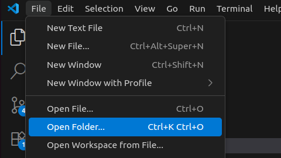
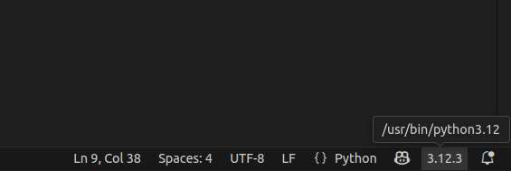
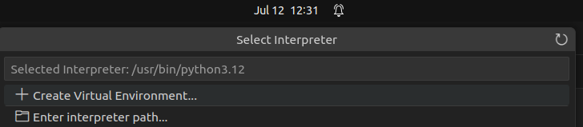
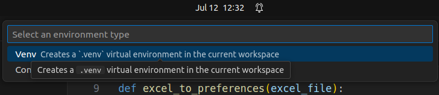
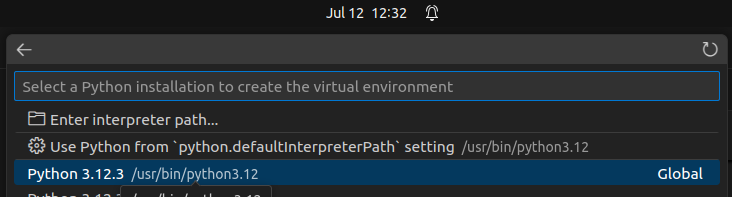
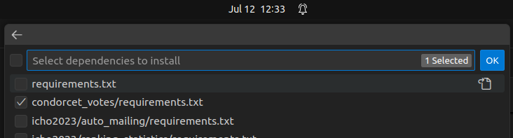
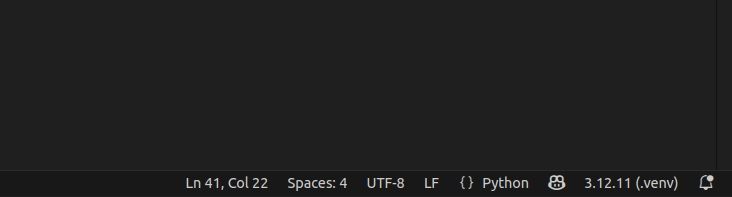

## Condorcet Evaluation

### Installation (only once)

Make sure you have python (it was tested with `python 3.12` but should work with any version above 3) installed and an appropriate editor (we suggest Visual Studio Code (VSCode) if you're not familiar).

Start VSCode and open the folder that contains this file:



Create a virtual environment and install the required dependencies according to the following: Open the python file in your editor and on the bottom right you should see a number such as `3.12.3`. Click this number and in the dialog that opens click `+ Create Virtual Environment`. This creates a python environment, with the required modules.











Now you need to wait for a few minutes since the dependencies are installed. Once done, the bottom right corner should look like:



### Usage

When you've done the installation steps once, just make sure you've activated the virtual environment (see steps above) and adapt the following variables in `condorcet_evaluation.py`:

```python
num_winners = 4  # Number of winners to retrieve
input_file = os.path.join(PROJECT_PATH, 'input_template.xlsx')  # Replace with the actual file name
```

and run the script by clicking the play button on the top right:


The chosen candidates will then be printed to the terminal.