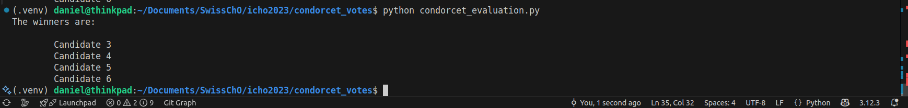

## Condorcet Evaluation

In order to view this file in nice formatting (in VSCode), press `crtl+Shift+V`.

### Installation (only once)

Make sure you have python (it was tested with `python 3.12` but should work with any version above 3) installed and an appropriate editor (we suggest Visual Studio Code (get it from [VSCode](https://code.visualstudio.com/download)) unless you're familiar with virtual environments).

Start VSCode and open the folder that contains this file:


Create a virtual environment and install the required dependencies according to the following: Open the python file in your editor and on the bottom right you should see `Select Interpreter` or a number such as `3.12.3`:


Click `Select Interpreter` and in the dialog that opens click `+ Create Virtual Environment`. This creates a python environment, with the required modules.


Select `Venv`:


Choose your python installation (if nothing shows up, install python from e.g. [Download Python 3.12.9](https://www.python.org/downloads/release/python-3129/)):


Tick `condorcet_votes/requirements.txt`:


Press OK to confirm. Now you need to wait for a few minutes since the dependencies are installed. Once done, the bottom right corner should look like:


You can cancel the process by pressing the `esc` key and restart in case you got lost.

### Usage

When you've done the installation steps once, just make sure you've activated the virtual environment (see second screenshot above) and adapt the following variables in `condorcet_evaluation.py`:

```python
num_winners = 4  # Number of winners to retrieve
input_file = os.path.join(PROJECT_PATH, 'input_template.xlsx')  # Replace with the actual file name
```

Make sure the votes in the excel file are provided in the same format as `input_template.xlsx`. In case your export consists of a `.csv` file, simply open it in excel and save it as `.xlsx`.

Sun the script by clicking the play button on the top right:


The chosen candidates will then be printed to the terminal:

